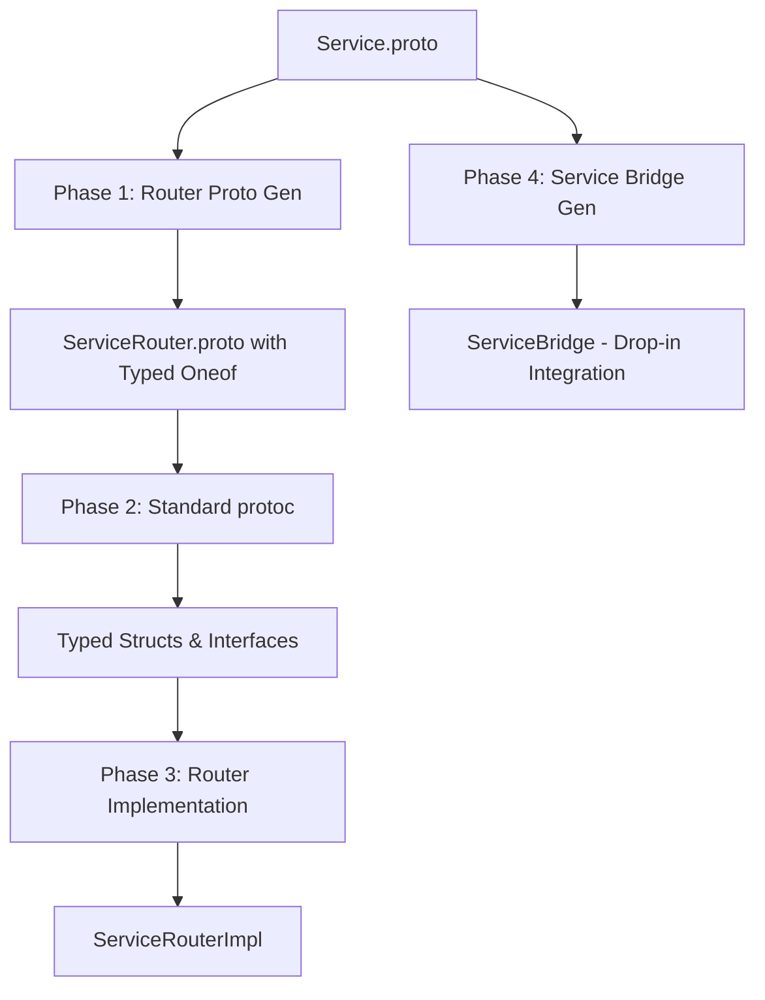

# gRPC Router - Type-Safe Service Routing with Auto-Generation

[](https://github.com/panyam/grpcrouter)
[](https://golang.org/)
[](LICENSE)

A sophisticated gRPC routing system that generates type-safe, service-specific routers with **zero manual translation code**. Enable seamless service routing through firewalls and network boundaries using persistent bidirectional streams.

## 🚀 Key Features

- **🔒 100% Type-Safe**: Complete elimination of `google.protobuf.Any` with compile-time type checking
- **🤖 Auto-Generated**: 4-phase generation pipeline creates complete router infrastructure from proto files
- **🔌 Drop-in Integration**: Works with existing gRPC services with minimal code changes
- **⚡ Zero-Copy Forwarding**: Real-time message forwarding without buffering
- **🌐 All gRPC Method Types**: Unary, server streaming, client streaming, and bidirectional streaming
- **📊 Built-in Registry**: Automatic service discovery, health checking, and instance management
- **🔄 Smart Routing**: Metadata-based, path-based, and header-based routing strategies

## 🏗️ Architecture Overview

### Revolutionary Auto-Generation Pipeline



### Connection Flow

```
┌─────────────┐    gRPC Calls     ┌─────────────────┐    Persistent     ┌─────────────────┐
│   Clients   │ ──────────────► │   Router Gateway │ ◄────Streams───► │ Service Instance │
│             │                 │  (Auto-Generated)│                   │ (Your Existing  │
│ Your Users  │ ◄────────────── │   Type-Safe      │                   │   Service)      │
└─────────────┘    Responses    └─────────────────┘                   └─────────────────┘
```

## 📦 Installation

```bash
# Clone the repository
git clone https://github.com/panyam/grpcrouter.git
cd grpcrouter

# Install dependencies
make install-deps

# Build the generation plugins
make build
```

## ⚡ Quick Start

### 1. Define Your Service

```protobuf
// myservice/v1/service.proto
syntax = "proto3";
package myservice.v1;

service MyService {
  rpc GetUser(GetUserRequest) returns (GetUserResponse);
  rpc StreamData(StreamRequest) returns (stream StreamResponse);
  rpc Upload(stream UploadRequest) returns (UploadResponse);
  rpc Chat(stream ChatMessage) returns (stream ChatMessage);
}

message GetUserRequest {
  string user_id = 1;
}

message GetUserResponse {
  string name = 1;
  string email = 2;
}
// ... other messages
```

### 2. Generate Complete Router Infrastructure

```bash
# Single command generates everything
./generate.sh
```

This creates:
- **Router Proto**: `MyServiceRouter.proto` with typed oneof messages  
- **Router Implementation**: `MyServiceRouterImpl` with embedded registry
- **Service Bridge**: `MyServiceBridge` for drop-in integration
- **Typed Structs**: Complete type-safe message handling

### 3. Router-Enable Your Existing Service (3 lines!)

```go
// main.go - Enable routing for your existing service
func main() {
    // Your existing service implementation
    service := &MyServiceImpl{}
    
    // Auto-generated bridge - handles everything!
    bridge := myservice.NewMyServiceBridge(service, nil)
    bridge.Start()
    defer bridge.Stop()
    
    // Service is now router-enabled with zero manual code!
    log.Println("Service connected to router with type-safe routing")
    bridge.Wait()
}
```

### 4. Start the Router Gateway

```go
// Start the auto-generated router
func main() {
    router := myservice.NewMyServiceRouterImpl(nil)
    
    server := grpc.NewServer()
    myservice.RegisterMyServiceRouterServer(server, router)
    
    log.Println("Type-safe MyService router listening on :8080")
    server.Serve(listener)
}
```

### 5. Clients Connect Normally

```go
// Clients connect to router as if it's the original service
conn, _ := grpc.Dial("router:8080")
client := myservice.NewMyServiceRouterClient(conn)

// All method types work transparently
user, _ := client.GetUser(ctx, &myservice.GetUserRequest{UserId: "123"})
stream, _ := client.StreamData(ctx, &myservice.StreamRequest{})
```

## 🔧 Generated Components

### Type-Safe Router Implementation

```go
// Auto-generated: service_router_impl.pb.go
type MyServiceRouterImpl struct {
    // Embedded service registry
    registry   *router.ServiceRegistry
    correlator *router.RequestCorrelator
    // ... connection management
}

// Type-safe method with zero Any usage
func (r *MyServiceRouterImpl) GetUser(ctx context.Context, req *GetUserRequest) (*GetUserResponse, error) {
    // Extract routing key from metadata
    routingKey := r.extractRoutingKey(ctx, req)
    
    // Find service instance
    instance, err := r.registry.SelectInstance("MyService", routingKey)
    
    // Create typed call (no google.protobuf.Any!)
    call := &MyServiceRpcCall{
        RequestId: generateID(),
        Method: "/MyService/GetUser",
        Request: &MyServiceRpcCall_GetUser{GetUser: req}, // Typed oneof
    }
    
    // Send and correlate typed response
    response := r.sendTypedCall(instance, call)
    return response.GetGetUser(), nil // Type-safe extraction
}
```

### Drop-in Service Bridge

```go
// Auto-generated: service_bridge.pb.go  
type MyServiceBridge struct {
    service MyServiceServer // Your existing implementation
    // ... auto-generated connection management
}

func (b *MyServiceBridge) Start() error {
    // Connects to router
    // Handles registration, heartbeats
    // Dispatches incoming calls to your service
    // Sends typed responses back
}

// Generated method handlers
func (b *MyServiceBridge) handleGetUser(requestID string, req *GetUserRequest) *MyServiceRpcResponse {
    resp, err := b.service.GetUser(context.Background(), req)
    return &MyServiceRpcResponse{
        RequestId: requestID,
        Response: &MyServiceRpcResponse_GetUser{GetUser: resp}, // Typed oneof
    }
}
```

## 📋 Examples

### Complete Working Example

```bash
# Terminal 1: Start the router
cd examples/myservice
./bin/router

# Terminal 2: Start a service instance  
./bin/service -mode=router -id=instance-1

# Terminal 3: Run client demo
./bin/demo
```

### Advanced Service Configuration

```go
// Configure the bridge with custom options
options := myservice.DefaultMyServiceBridgeOptions()
options.RouterAddr = "router.prod.com:443"
options.InstanceID = "user-service-west-1"
options.Metadata = map[string]string{
    "region":        "us-west-1", 
    "version":       "v1.2.3",
    "capabilities":  "ssl,compression",
}

bridge := myservice.NewMyServiceBridge(service, options)
```

## 🚦 Message Flow

### Unary RPC Flow
```
Client --(GetUser req)--> Router --(typed call)--> Service Instance
Client <--(GetUser res)-- Router <--(typed resp)-- Service Instance
                        [Zero copying, type-safe throughout]
```

### Streaming RPC Flow  
```
Client ◄──► Router ◄──► Service Instance
       Real-time bidirectional forwarding
       Each message individually routed
       No buffering or batching
```

## 🎯 Benefits Over Traditional Approaches

| Feature | Traditional gRPC | Generic Proxies | **gRPC Router** |
|---------|------------------|-----------------|-----------------|
| Type Safety | ✅ Service-only | ❌ Runtime errors | ✅ **End-to-end** |
| Code Generation | ✅ Service stubs | ❌ Manual config | ✅ **Complete pipeline** |
| Existing Service Integration | ✅ Native | ❌ Requires changes | ✅ **3-line drop-in** |
| Network Traversal | ❌ Direct only | ⚠️ HTTP proxying | ✅ **Persistent streams** |
| Streaming Support | ✅ Full | ⚠️ Buffered | ✅ **Real-time forwarding** |
| Service Discovery | ❌ External | ⚠️ Basic | ✅ **Built-in registry** |

## 🛠️ Build Commands

```bash
# Generate everything
make generate

# Build all binaries  
make build

# Run tests
make test

# Clean generated files
make clean

# Example-specific commands
cd examples/myservice
make build          # Build router, service, demo
make demo           # Run end-to-end demo
./generate.sh       # Regenerate from proto
```

## 📁 Project Structure

```
grpcrouter/
├── 🔧 cmd/                          # Generation plugins
│   ├── protoc-gen-grpcrouter-proto/    # Phase 1: Router proto generation
│   ├── protoc-gen-grpcrouter-impl/     # Phase 3: Router implementation  
│   └── protoc-gen-grpcrouter-bridge/   # Phase 4: Service bridge generation
├── 📦 router/                       # Core router libraries
│   ├── correlation.go                  # Request correlation system
│   ├── registry.go                     # Service instance registry
│   └── config.go                       # Router configuration
├── 🌐 proto/                        # Core protobuf definitions
│   └── grpcrouter/v1/
│       └── router.proto                # Router service and types
├── 📋 examples/myservice/           # Complete working example
│   ├── proto/myservice/v1/             # Example service definition
│   ├── gen/                           # Generated code output
│   ├── cmd/                           # Example binaries
│   │   ├── router/                    # Auto-generated router
│   │   ├── service/                   # Service with bridge integration
│   │   └── demo/                      # Client demo
│   ├── buf.gen.yaml                   # Generation configuration
│   └── generate.sh                    # 4-phase generation script
├── 📖 docs/                        # Documentation
├── 🧪 tests/                       # Integration tests
└── 📄 Makefile                     # Build automation
```

## 🔄 4-Phase Generation Process

### Phase 1: Router Proto Generation
- Input: `MyService.proto`
- Output: `MyServiceRouter.proto` with typed oneof messages
- Eliminates `google.protobuf.Any` usage

### Phase 2: Standard Protoc Generation  
- Input: Generated router proto
- Output: Typed Go structs and gRPC interfaces
- Uses standard protoc plugins

### Phase 3: Router Implementation Generation
- Input: Router proto + service info
- Output: Complete `MyServiceRouterImpl` with registry
- Type-safe method implementations

### Phase 4: Service Bridge Generation
- Input: Original service proto
- Output: `MyServiceBridge` for drop-in integration
- Handles connection, registration, and dispatch

## 🚀 Advanced Features

### Routing Strategies

```go
// Metadata-based routing (default)
ctx = metadata.AppendToOutgoingContext(ctx, "instanceid", "user-service-1")

// Path-based routing for gRPC-Web
options.PathPrefix = "/api/v1/users"

// Header-based routing  
options.RoutingHeader = "X-Service-Instance"
```

### Health Checking & Service Discovery

```go
// Built-in health monitoring
bridge.SetHealthChecker(func() pb.HealthStatus {
    if service.IsHealthy() {
        return pb.HealthStatus_HEALTHY
    }
    return pb.HealthStatus_UNHEALTHY
})

// Automatic service discovery
instances := router.ListInstances("MyService")
```

### Load Balancing

```go
// Configure load balancing strategy
config := &router.RouterConfig{
    LoadBalanceStrategy: router.CONSISTENT_HASH,
    HealthCheckInterval: 30 * time.Second,
}
```

## 🤝 Contributing

1. Fork the repository
2. Create your feature branch (`git checkout -b feature/amazing-feature`)
3. Make your changes
4. Run tests (`make test`)
5. Commit your changes (`git commit -m 'Add amazing feature'`)
6. Push to the branch (`git push origin feature/amazing-feature`)
7. Open a Pull Request

## 📝 License

This project is licensed under the GPL License - see the [LICENSE](LICENSE) file for details.

## 🙏 Acknowledgments

- Built on the robust gRPC ecosystem
- Inspired by service mesh architectures
- Designed for enterprise-scale deployments

---

**⭐ Star this repo if you find it useful!**

For questions, issues, or feature requests, please [open an issue](https://github.com/panyam/grpcrouter/issues).
